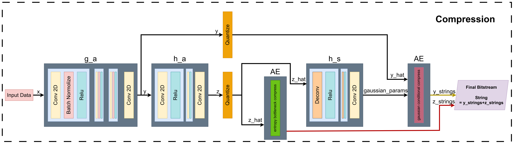
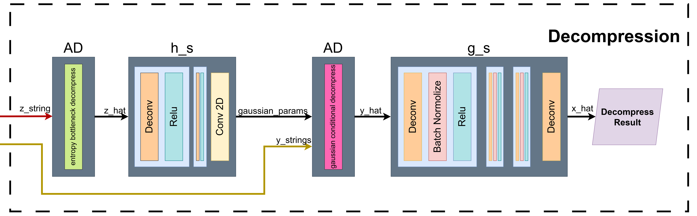

# TIC - Satellite Image Compression System

本專案是一個針對衛星影像設計的深度學習影像壓縮系統。系統核心針對跨平台（x86 Server 與 ARM Edge Device）運算的數值精確度進行了特殊優化，確保壓縮與解壓縮過程的一致性。

## 目錄 (Table of Contents)

* [專案概述 (Overview)](#專案概述-overview)
* [模型架構 (Model Architecture)](#模型架構-model-architecture)
    * [1. 主自動編碼器 (Main Autoencoder)](#1-主自動編碼器-main-autoencoder)
    * [2. 熵模型與超先驗 (Entropy Model & Hyperprior)](#2-熵模型與超先驗-entropy-model--hyperprior)
    * [3. 架構差異說明 (Architecture Differences)](#3-架構差異說明-architecture-differences)
* [資料集與預處理 (Dataset & Preprocessing)](#資料集與預處理-dataset--preprocessing)
    * [訓練資料 (Training Data)](#訓練資料-training-data)
    * [資料預處理 (Preprocessing)](#資料預處理-preprocessing)
    * [推論測試資料 (Inference Data)](#推論測試資料-inference-data)
* [核心運作邏輯 (Core Operational Logic)](#核心運作邏輯-core-operational-logic)
    * [1. 跨平台確定性優化 (Cross-Platform Determinism)](#1-跨平台確定性優化-cross-platform-determinism)
    * [2. 靜態機率表與 LUT (Fixed CDFs & LUT)](#2-靜態機率表與-lut-fixed-cdfs--lut)
    * [3. 自定義衛星封包格式 (Custom Satellite Packet)](#3-自定義衛星封包格式-custom-satellite-packet)
    * [4. 容錯與熔斷機制 (Fault Tolerance & Sanitizer)](#4-容錯與熔斷機制-fault-tolerance--sanitizer)
* [安裝與環境設定 (Installation)](#安裝與環境設定-installation)
    * [1. 建立虛擬環境 (Server/PC)](#1-建立虛擬環境-serverpc)
    * [2. 板端環境設定 (Embedded Board)](#2-板端環境設定-embedded-board)
* [訓練流程 (Training)](#訓練流程-training)
* [使用說明 (Usage)](#使用說明-usage)
    * [1. 部署前準備：生成機率表 (Deployment Prep)](#1-部署前準備生成機率表-deployment-prep)
    * [2. 壓縮 (Compress)](#2-壓縮-compress)
    * [3. 解壓縮 (Decompress)](#3-解壓縮-decompress)
* [參考文獻 (References)](#參考文獻-references)
---

## 專案概述 (Overview)

TIC (Tiny Image Compression) 旨在解決衛星端（Edge）有限頻寬與運算資源下的影像傳輸問題。系統包含兩大主要模組：

1. **壓縮端 (`_compress.py`)**：負責將大型衛星影像切割、編碼並封裝成帶有 CRC 校驗的二進位封包。
2. **解壓縮端 (`_decompress.py`)**：負責接收封包、驗證完整性、解碼並還原成完整影像。

本系統特別處理了浮點數運算在不同硬體架構下的誤差問題，確保從衛星（ARM/FPGA）傳輸到地面站（x86）的資料能被正確還原。

---

## 模型架構 (Model Architecture)

本專案核心採用 **SimpleConvStudentModel**，這是一個基於變分自編碼器 (Variational Autoencoder, VAE) 的端對端影像壓縮模型。架構設計參考了 Scale Hyperprior 機制。

### 1. 主自動編碼器 (Main Autoencoder)
負責影像特徵的提取與重建，整體下採樣率為 16 ($2^4$)。

* **非線性轉換編碼器 (Encoder, $g_a$)**：
    * 負責將輸入影像 $x$ 映射為潛在特徵 (Latent Representation) $y$。
    * 由 4 層卷積層 (Convolution) 組成，每層 Stride=2，逐步將影像長寬縮小為原圖的 $1/16$。
    * **結構細節**：使用 3x3 與 5x5 Kernel。

* **非線性轉換解碼器 (Decoder, $g_s$)**：
    * 負責將量化後的特徵 $\hat{y}$ 還原為重建影像 $\hat{x}$。
    * 由 3 層反卷積層與 1 層標準卷積組成。為了提升計算效率並抑制反卷積常見的棋盤格效應 (Checkerboard Artifacts)，採用 **PixelShuffle** 進行上採樣 (Upsampling)。

### 2. 熵模型與超先驗 (Entropy Model & Hyperprior)
為了更有效地壓縮特徵 $y$，模型引入了旁支網路來估計 $y$ 的統計分佈參數。

* **超編碼器 (Hyper-Encoder, $h_a$)**：
    * 接收特徵 $y$，進一步壓縮生成「超潛在變數」 (Hyper-Latent) $z$。此 $z$ 用於捕捉影像的空間相關性資訊。
* **超解碼器 (Hyper-Decoder, $h_s$)**：
    * 接收量化後的 $\hat{z}$，還原出高斯分佈的參數 $(\mu, \sigma)$。

### 3. 架構差異說明 (Architecture Differences)
本模型與原始 Variational Image Compression (Ballé et al., 2018) 論文架構有以下顯著差異，旨在適應衛星硬體限制與提升壓縮效能：

1.  **激活函數與標準化層 (Activation & Norm)**：
    * **原論文**：使用 GDN (Generalized Divisive Normalization) 與 IGDN。
    * **本專案**：改用標準的 **Batch Normalization** 搭配 **ReLU**。GDN 運算複雜度較高且對某些硬體加速器支援度較差，BN+ReLU 方案在保持效能的同時大幅提升了推論速度。
    
2.  **超合成轉換(Hyper Synthesis Transform) ($\hat{z}$ Usage)**：
    * **原論文**：通常僅使用 $\hat{z}$ 來預測 $\hat{y}$ 的尺度 (Scale, $\sigma$)。
    * **本專案**：在 Hyper 輔助編碼部分（ $\hat{z}$ path），我們採用了 **Mean & Scale** 策略。即 $h_s$ 網路會同時輸出平均值 (Mean, $\mu$) 與尺度 (Scale, $\sigma$) 來參數化 $\hat{y}$ 的高斯分佈。這提供了更精準的機率估計，與原始僅使用 Scale 的做法不同。

---

## 資料集與預處理 (Dataset & Preprocessing)

### 訓練資料 (Training Data)
* **資料集來源**：使用 **Sen12MS-CR** 資料集。
* **資料特性**：包含有雲與無雲的 Sentinel-2 多光譜影像。
* **規模**：共約 **240,000** 張影像。

### 資料預處理 (Preprocessing)
為了使模型能適應 Sentinel-2 的 12-bit/16-bit 數據格式，訓練前進行了以下處理：
1.  **亮度過濾**：像素值大於 **10,000** 的區域視為過亮（或雲層反射），予以去除或視為無效值。
2.  **數值正規化**：將所有像素值除以 **10,000**，將數值域映射至 `0.0 ~ 1.0` 之間，以利神經網路訓練收斂。

### 推論測試資料 (Inference Data)
* **來源**：使用來自 **UP42.com** 取得的 Sentinel-2 GSD **台灣地區**影像，用於驗證模型在真實場景下的壓縮效能。

---

## 核心運作邏輯 (Core Operational Logic)



### 1. 跨平台確定性優化 (Cross-Platform Determinism)

為了消除 ARM 與 x86 架構之間因浮點數精度差異導致的解碼破圖，系統採用了 **Monkey Patching** 技術：

* **雙倍精度強制 (Forced Double Precision)**：在計算熵模型參數時，將 Hyper-Synthesis 層 (`h_s`) 及其輸入強制轉換為 `float64` 進行運算，隨後再轉回 `float32` 進行量化。

### 2. 靜態機率表與 LUT (Fixed CDFs & LUT)

為了避免在衛星端進行高算力的熵模型動態更新，並確保編解碼一致性，本系統採用 **Look-up Table (LUT)** 方案：

* **生成 (`_dump_cdf.py`)**：在訓練完成後，使用此腳本預先計算所有可能的機率累積分佈函數 (CDF)。
* **部署 (`_fixed_cdfs.py`)**：將計算好的 CDF 存成靜態檔案。
* **應用**：衛星端（編碼）與地面站（解碼）同時載入此 LUT。這不僅大幅降低了板端運算量，也確保了兩端參照的機率模型完全一致。

### 3. 自定義衛星封包格式 (Custom Satellite Packet)

壓縮後的資料儲存為自定義二進位封包 (`.bin`)：

| 欄位 | 大小 | 說明 |
| --- | --- | --- |
| **Magic** | 3 bytes | 固定為 `TIC` |
| **ID** | 1 byte | 影像 ID |
| **Row/Col** | 1 byte each | 切割區塊索引 |
| **H, W** | 2 bytes each | 原始區塊長寬 |
| **LenY, LenZ** | 4 bytes each | Y 與 Z 字串長度 |
| **Payload** | Variable | 壓縮位元流 |
| **CRC32** | 4 bytes | 封包完整性校驗碼 |

### 4. 容錯與熔斷機制 (Fault Tolerance & Sanitizer)

* **CRC32 校驗**：防止傳輸錯誤擴散。
* **數值熔斷器 (Sanitizer)**：解碼後若特徵值出現 `NaN` 或絕對值超過 100.0，自動替換為 Mean 值，避免重建影像產生嚴重雜訊。

---

## 安裝與環境設定 (Installation)

### 1. 建立虛擬環境 (Server/PC)

```bash
python -m venv .venv
source .venv/bin/activate
pip install -r ./requirements.txt
pip install -e .
```

### 2. 板端環境設定 (Embedded Board)

針對板端執行環境，需確保 pip 版本更新：

```bash
.venv/bin/python3 -m ensurepip --upgrade
.venv/bin/python3 -m pip install --upgrade pip
pip install -e .
```

## 訓練流程 (Training)

若需重新訓練模型，請執行 `_train.py`。以下為標準訓練指令範例：

```bash
python _train.py \
  -m tic \
  -d ~/TIC/s2_combined \
  -e 200 \
  --batch-size 192 \
  --num-workers 32 \
  --cuda \
  --gpu-id 0 \
  -q 5 \
  --name "mean_scale_no_roi"
```

### 參數說明：

* **`-m tic`**：指定模型架構 (Model architecture)。
* **`-d <path>`**：指定訓練資料集路徑 (Dataset path)，此處應指向 Sen12MS-CR 整合後的資料夾。
* **`-e 200`**：訓練的 Epoch 數 (總訓練輪數)。
* **`--batch-size 192`**：批次大小，請依據 GPU VRAM 大小調整。
* **`--num-workers 32`**：資料載入的執行緒數量 (Dataloader workers)。
* **`--cuda`**：啟用 GPU 加速。
* **`--gpu-id 0`**：指定使用的 GPU ID。
* **`-q 5`**：品質參數 (Quality Factor)，數值越高代表目標 Bit-rate 與品質越高（同時模型也會學到保留更多細節）。
* **`--name "mean_scale_no_roi"`**：實驗名稱，將用於命名 Checkpoint 與 Log 檔案。

---

## 使用說明 (Usage)

在使用壓縮或解壓縮功能前，請務必先完成「步驟 1」的機率表生成。

### 1. 部署前準備：生成機率表 (Deployment Prep)

**非常重要**：在進行壓縮/解壓縮之前，必須先計算出靜態機率表 (CDF)。

```bash
python _dump_cdfs.py
```

* **輸出**：執行後會產生 `_fixed_cdfs.py`。
* **部署**：請確保 **衛星端 (壓縮)** 與 **地面站 (解壓縮)** 的 目錄下都有這份相同的 `_fixed_cdfs.py` 檔案。

### 2. 壓縮 (Compress)

執行 `_compress.py`。程式會自動將影像 Padding 至 64 的倍數，並以 256x256 為單位進行切割與壓縮。

```bash
python _compress.py "input_image.png" \
    -p "../checkpoint_best_loss.pth" \
    -o "output_directory" \
    --id 1
```

### 3. 解壓縮 (Decompress)

執行 `_decompress.py`。程式會掃描目錄下的 `.bin` 檔，驗證 CRC 並拼貼還原。還原後的影像會自動調亮 1.8 倍。

```bash
python _decompress.py "output_directory" \
    -p "../checkpoint_best_loss.pth" \
    --original "input_image.png"
```

## 參考文獻 (References)

本系統的理論架構基礎參考自以下論文：

1. **[Variational Image Compression with a Scale Hyperprior](https://arxiv.org/abs/1802.01436)**
* *Johannes Ballé, David Minnen, Saurabh Singh, Sung Jin Hwang, Nick Johnston*


2. **[Joint Autoregressive and Hierarchical Priors for Learned Image Compression](https://arxiv.org/abs/1809.02736)**
* *David Minnen, Johannes Ballé, George Toderici*


